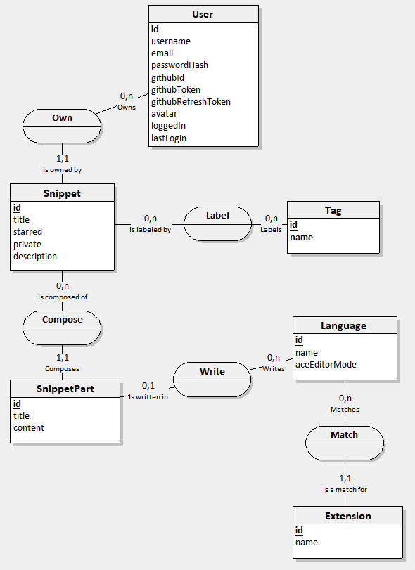

# Snippets Vue 2

Snippets Vue 2 is a code snippets organizer where you can store and share your boilerplates or any relevant code examples.
This Github project only includes the frontend. The backend is its own separate project.

----

Snippets Vue 2 est un organiseur de code qui vous permet de stocker et partager vos boilerplates et autres exemples de code pertinents.
Ce projet Github inclut seulement le front. Le backend est un projet à part entière.

[Demo](https://ml29.com/snippets)

[Backend project](https://github.com/ml-29/snippets-backend)

[API documentation](https://documenter.getpostman.com/view/17948969/2sA2xpS9AH)

## Preview / Aperçu

https://github.com/ml-29/snippets_vue2/assets/86920107/3afdf4ec-4c72-42b1-a345-3585aa110119

## Analysis / Analyse

